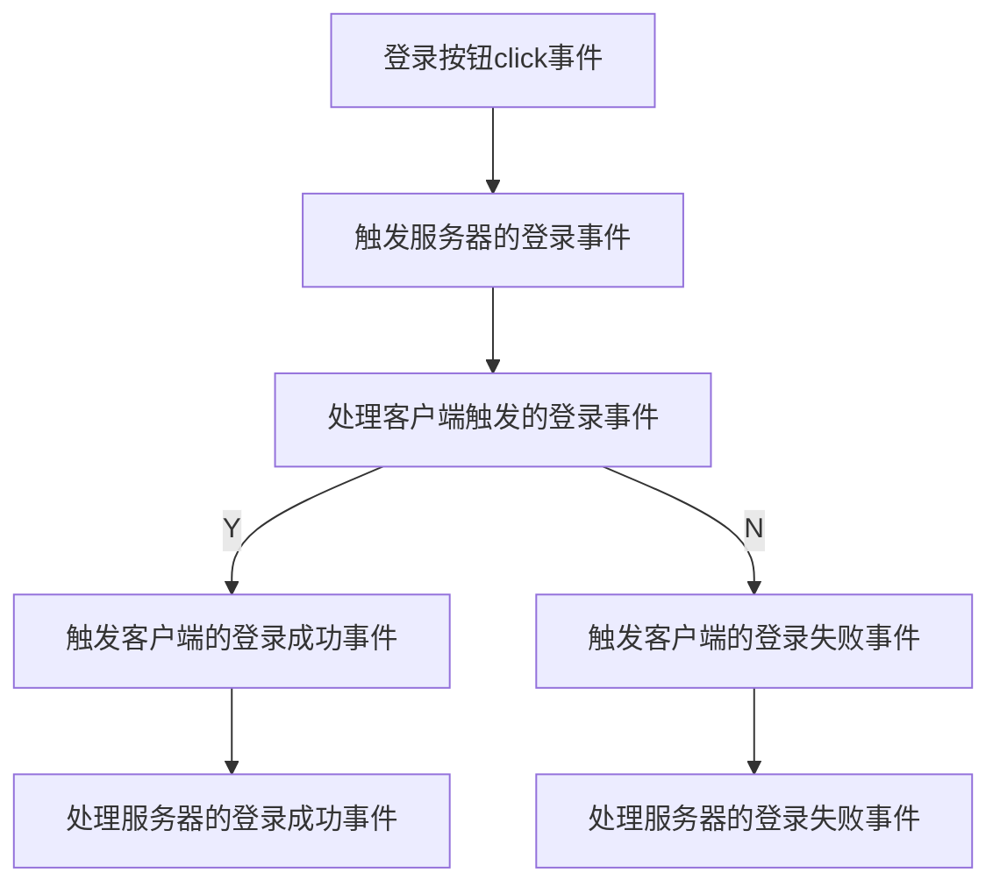

<div  align='center'>
<font size='6'>湖南科技大学计算机科学与工程学院</font>
<br><br><br>
<font size='8'>Java课程设计报告</font>
<br><br><br>
<font size='5'>专业班级：21级计科五班</font><br><br>
<font size='5'>姓   名：李龙华</font><br><br>
<font size='5'>学   号：2105010614</font><br><br>
<font size='5'>指导教师：肖宇峰</font><br><br>
<font size='5'>时   间：2023-06-06</font><br><br>
<font size='5'>地   点：逸夫楼431</font><br><br>
</div>


# 仿QQWeb即时聊天系统

[TOC]

<br>

## 一、实验题目

**仿QQWeb即时聊天系统**

## 二、实验目的

* **实现Web的点对点即时的文本消息聊天功能。**
* **实现Web的表情的发送、接收和显示功能。**
* **实现Web的图片的发送、接收和显示功能。**
* **实现本地消息的存储，在离线的时候也能加载和查看历史消息。**
* **要求使用WebSocket。**

## 三、总体设计

### 3.1、背景知识

####  3.1.1、[WebSocket](https://blog.csdn.net/wulong710/article/details/115005960)

##### 3.1.1.1、WebSocket的基本概念

* WebSocket 是基于TCP/IP协议，独立于HTTP协议的通信协议。
* WebSocket 是双向通讯，有状态，客户端一（多）个与服务端一（多）双向实时响应（客户端 ⇄ 服务端）。
* WebSocket 是一个持久化的协议，是有状态的协议。
* WebSocket 是应用在浏览器的 Socket （是 Socket 模型接口的实现），Socket 是一个网络通信接口 （通信规范）。

##### 3.1.1.2、WebSocket的工作原理

1. 用户打开Web浏览器，并访问Web站点。
2. Web浏览器（客户端）与Web服务端建立连接。
3. Web浏览器（客户端）能定时收发Web服务端数据，Web服务端也能定时收发Web浏览器数据。


#### 3.1.2、[nodejs](https://www.runoob.com/nodejs/nodejs-tutorial.html)

##### 3.1.2.1、nodejs的基本概念

Node.js 是一个事件驱动 I/O 服务端 JavaScript 环境，基于 Google 的 V8 引擎，V8 引擎执行 Javascript 的速度非常快，性能非常好。

##### 3.1.2.2、nodejs的基本组成部分

1. require 指令：在 Node.js 中，使用 require 指令来加载和引入模块，引入的模块可以是内置模块，也可以是第三方模块或自定义模块。
```js
const module=require('module-name')
```
2. 创建服务器：服务器可以监听客户端的请求，类似于 Apache 、Nginx 等 HTTP 服务器。
```js
const server=module.createServer()
```
3. 接收请求与响应请求 服务器很容易创建，客户端可以使用浏览器或终端发送 HTTP 请求，服务器接收请求后返回响应数据。

#### 3.1.3、[Socket.IO](https://socket.io/zh-CN/docs/v4/)

##### 3.1.3.1、Socket.IO的基本概念

* Socket.IO 是一个库，可以在客户端和服务器之间实现低延迟, 双向和基于事件的通信。

* 它建立在 WebSocket 协议之上，并提供额外的保证，例如回退到 HTTP 长轮询或自动重新连接。

##### 3.1.3.2、[Socket.IO的搭建过程]([socket.io 概述_w3cschool](https://www.w3cschool.cn/socket/socket-1olq2egc.html))(基于 Express 3/4)

1. 服务器
```js
var app = require('express')();
var server = require('http').Server(app);
var io = require('socket.io')(server);

server.listen(80);

app.get('/', function (req, res) {
  res.sendfile(__dirname + '/index.html');
});

io.on('connection', function (socket) {
  socket.emit('news', { hello: 'world' });
  socket.on('my other event', function (data) {
    console.log(data);
  });
});
```
2. 客户端
```html
<script src="/socket.io/socket.io.js"></script>
<script>
  var socket = io.connect('http://localhost');
  socket.on('news', function (data) {
    console.log(data);
    socket.emit('my other event', { my: 'data' });
  });
</script>
```

### 3.2、模块介绍

#### 3.2.1、密码登录界面

该模块主要是实现用户密码登录的功能，登录成功则进入聊天界面，登录失败则弹出登录失败提示框，不允许重复登录。主要用到了mysql数据库来存储用户的个人信息，通过查询数据库表的信息来判断是否存在该用户。


#### 3.2.2、聊天界面

* 该聊天界面主要实现了文本信息、表情和图片的接受、发送以及显示功能，还有查看聊天记录的功能，以及添加好友和删除好友的功能。
* 消息部分主要通过emit触发事件和on注册事件来实现客户端和服务端之间交流的。

```js
//服务器
// 到所有连接的客户端
io.emit("hello");
// 致“news”房间中的所有连接客户端
io.to("news").emit("hello");
```

```js
//客户端
//注册事件
socket.on((""),{

})
//触发事件
socket.emit((""),{

})
```

* 聊天记录的查询主要是通过将聊天数据存储到数据库中实现的，由于聊天数据的记录长短不一，如果再用关系型数据库就会浪费太多空间，因此我选择了非关系型数据库mongo。


#### 3.2.3、注册界面

该模块主要实现用户的注册功能，连接mysql数据库，通过数据库的插入语句将用户注册的信息插入到对应的用户表中,如果该用户已经注册则弹出注册失败的提示框，否则注册成功。


#### 3.2.4、扫码登录界面

该模块主要实现了扫码登录功能，由于我这个没有真正的实现网络互通，因此对于这个扫码功能的实现我的想法是在用户注册的时候给用户生成一个唯一的二维码，然后将生成的二维码图片保存到相对应的文件夹下面，当扫描登录时只需要选取相应的二维码即可实现对应用户的快捷登录功能。


## 四、详细设计

### 4.1、登录功能

#### 4.1.1、数据库user表：
|id(账号)|password(密码)|name(昵称)|image(头像)|
|:-:|:-:|:-:|:-:|
|001|123|李龙华|01.png|
|002|123|李婷|11.png|
|003|123|姚艳梅|12.png|
|004|123|周小康|07.png|
|005|123|李文|09.png|
|006|123|付豪|avatar.jpg|

#### 4.1.2、流程图：

#### 4.1.3、关键代码部分：

##### 4.1.3.1、客户端登录按钮的点击事件处理：
```js
//点击登录按钮
  $('.box-login #btn').on('click',function(){

    var id =$('.box-login #userid').val()
    var password=$('.box-login #userpwd').val()
    if(id==='')alert('账号不能为空')
    else if(password=='')alert('密码不能为空')
    else{
    console.log(id)
    console.log(password)
    //触发登录事件
    socket.emit('login',{userid:id,userpwd:password})
    }
})
```
##### 4.1.3.1、服务端登录事件的处理：
 1. 定义一个全局变量用来存储已经登录过的用户信息

 ```js
 //记录所有已经登录过的用户
var users=[]
 ```

 2. 连接mysql数据库

```js
//连接数据库
var mysql = require('mysql');
var connection = mysql.createConnection({
      host     : 'localhost',
      user     : 'root',
      password : '123456',
      database : 'test'
    });
    connection.connect();
```

3. 查看数据库中的表是否存在该用户，如果则比较全局变量users是否存在该用户，如果存在则重复登录，否则将该用户信息记录到users中,表中不存在则登录失败。

```js
 //查看是否重复登录
const user=users.find(item => item.id === result[0].id)
```
```js
//重复登录
socket.emit('relogin')
```
```js
//触发登录成功事件
socket.emit('login-Sucees',result[0])
```
```js
//触发登录失败事件
socket.emit('login-fail')
```

### 4.2、聊天功能

#### 4.1.1、流程图:


#### 4.1.2、数据结构:

##### mongo数据库中的集合qqchat:
|_id|name|toname|msg|index|img|awatar|
|:-:|:-:|:-:|:-:|:-:|:-:|:-:|
|key|发送者的名字|接收者的名字|文字或者表情包消息|是否为表情包消息|图片消息|发送者的头像|

#### 4.1.3、关键的代码部分:

##### 4.1.2.1、通过点击相应的用户div添加对应的聊天面板

```js
async function liaotian(name){
  console.log('执行了聊天面板')
$('.box2 .liaotian').append(`
<div class=${name} maincomment style="display:none;"></div>
`)
}
```
##### 4.1.2.2、发送消息给服务器

1. 将发送者的名字，头像，接受者的名字，头像封装成一个对象发送给服务器。

```js
socket.emit('sendmessge',{avatar:myavatar,name:myname,msg:mymsg,toname:toname,index:index,img:html})
```

2. 连接mongo数据库，将聊天记录存到相应的集合当中。

```js
var MongoClient = require('mongodb').MongoClient;
var url = "mongodb://127.0.0.1:27017/?directConnection=true&serverSelectionTimeoutMS=2000&appName=mongosh+1.9.1";
MongoClient.connect(url).then((conn) => {
  console.log("数据库已连接");
  const qq = conn.db("qqweb").collection("qqchat");
qq.insertOne({"name":data.name,"toname":data.toname,"msg":data.msg,"index":data.index,"img":data.img,"avatar":data.avatar})
 .catch((err) => {
      console.log("数据库操作错误");
  }).finally(() => {
      conn.close();
  });
}).catch((err) => {
  console.log("数据库连接失败");
});
```

3、通过广播发送给所有人消息或者发送给指定的用户消息。

```js
//广播消息,发送给所有人
io.emit('receviemesggemyself',data)
```
```js
//发送给指定的用户
//登录的用户都会自动装入io.sockets.sockets
    var SocketConnections=io.sockets.sockets;
    // console.log(SocketConnections)
    SocketConnections.forEach(s=>{
      if(s.name===data.toname && s.name!=data.name){
        tosocket=s.id
      }
    })
    if(tosocket){
      console.log(tosocket)
      //发送给指定的用户
      io.to(tosocket).emit('receviemesggeother',data)
```

1. 文字消息

```js
//通过判断index是否为-1来判断是否为文字消息
//index=-1则为文字消息
$('.'+data.toname).append(`
  <div class="message-box">
    <div class="my-message">
     <div class="nickname">${data.name}</div>
     <div class="content">
       <div class="bubble">
      <div class="bubble_cont">${data.msg}</div>
       </div>
     </div>
      
    </div>
    </div><br>`)
```

2. 图片消息

```js
//通过读取文件流对象，获得图片的base64编码形式
var reader  = new FileReader();
  //注册监听事件图片加载完成
  reader.addEventListener("load", function () {
    console.log(reader.result)
    mymsg=reader.result
  //发送图片给用户
  socket.emit('sendImage',{
    avatar:myavatar,
    name:myname,
    msg:mymsg,
    toname:toname,
    index:-1
  })
  }, false);

  if (file) {
    reader.readAsDataURL(file);
  }
```

```js
$('.'+data.toname).append(`
  <div class="message-box">
    <div class="my-message">
      <div class="nickname">${data.name}</div>
      <div class="content">
        <div class="bubble_cont">
          
        </div>
      </div>
      
    </div>
    </div><br>`)
```


3. 表情包消息

```js
//判断是否为表情包消息
//index!=-1为表情包消息
mymsg=$('.mainsend #content').text()
   html=$('.mainsend #content').html().trim()
   var x=html.indexOf('')
   var index=-1
   if(x!=-1&&y!=-1&&z!=-1){
    index=1
   }
```
```js
//表情包是在本地固定的位置，因此可以把它看作一张图片来处理
 $('.'+data.toname).append(`
    <div class="message-box">
      <div class="my-message">
        <div class="nickname">${data.name}</div>
        <div class="content">
        <div class="bubble">
          <div class="bubble_cont">${data.img}</div>
        </div>
      </div>
        
      </div>
      </div><br>`)
```
```js
//初始化jquery-emoji插件，将相应的表情包图片导入
$("#content").emoji({
    button: ".face",
    showTab: true,
    animation: 'slide',
    position:'topRight',
    icons: [{
        name: "贴吧表情",
        path: "lib/img/tieba/",
        maxNum: 50,
        file: ".jpg",
        placeholder: ":{alias}:"
   }, {
        name: "QQ高清",
        path: "lib/img/qq/",
        maxNum: 91,
        excludeNums: [41, 45, 54],
        file: ".gif",
        placeholder: "#qq_{alias}#"
    }, {
        name: "emoji高清",
        path: "lib/img/emoji/",
        maxNum: 84,
        file: ".png",
        placeholder: "#emoji_{alias}#"
    }]
    })
```
### 4.3、好友功能

#### 4.3.1、流程图:


#### 4.3.2、数据结构:

##### mongo数据库中的集合qqfriends:
|_id|name|toname|toavatar|
|:-:|:-:|:-:|:-:|
|key|发送者的名字|接收者的名字|接收者的头像|

#### 4.3.2、关键代码部分:

1. 发送当前用户的信息给服务器

```js
//实现当前面板的隐藏和要聊天对象的出现,none修饰的元素不会被渲染和占用空间
$(".liaotian ."+toname).attr("style","display:none;");//隐藏div
    $div.addClass('active').siblings().removeClass('active')
```
```js
$(".liaotian ."+toname).attr("style","display:block;");//显示div
```
##### 添加好友
```js
//客户端
//添加好友函数
async function addfriend(friendavatar,friendname){
  const response=await fetch(`/addfriend?myname=${myname}&myavatar=${myavatar}&friendname=${friendname}&friendavatar=${friendavatar}`)
   if(response.ok)
   {
    const data=await response.json()
    console.log('------------')
    console.log(data.sucess)
    console.log('------------')
    if(data.sucess){
    alert('添加成功')
    //注册一个添加好友成功事件
    socket.emit('toadd')
    }else{
    alert('已存在该好友')
    }
  }else{
    alert('添加失败')
  }
  }
```
##### 删除好友
```js
//客户端
//删除好友函数
async function delfriend(friendavatar,friendname){
  const response=await fetch(`/delfriend?myname=${myname}&myavatar=${myavatar}&friendname=${friendname}&friendavatar=${friendavatar}`)
   if(response.ok)
   {
    const data=await response.json()
    console.log('------------')
    console.log(data.sucess)
    console.log('------------')
    alert('删除成功')
    //注册一个添加好友删除事件
     socket.emit('todel')
   }
  }
  socket.on("haoyou",()=>{
    friends()
  })
```
2.服务器接受相应的信息去mongo数据库查找相应的信息并返回给客户端

```js
//服务端
app.get('/addfriend',async(req, res)=>{
await add(myname,myavatar,toname,toavatar)
//使用异步函数
async function add(myname,myavatar,toname,toavatar){
//添加好友
   await qq.insertMany([{"name":myname,"toname":toname,"toavatar":toavatar},{"name":toname,"toname":myname,"toavatar":myavatar}])
   }
}）
```
3.服务器接受相应的信息去mongo数据库删除相应的信息并返回给客户端

```js
//服务端
app.get('/delfriend',async(req, res)=>{
 del(myname,myavatar,toname,toavatar)
 async function del(myname,myavatar,toname,toavatar){
 //删除好友
   await qq.deleteOne({"name":myname,"toname":toname,"toavatar":toavatar})
   await qq.deleteOne({"name":toname,"toname":myname,"toavatar":myavatar})
   }
 })
```
4.客户端更新相应的好友列表

```js
//好友列表函数
async function friends(){
  const response=await fetch(`/friends?myname=${myname}`)
   if(response.ok)
   {
    const data=await response.json()
    console.log('------------')
    console.log(data.friends)
    console.log('------------')
    $('.friendlist').html('')
    data.friends.forEach(item => {
   $('.friendlist').append(`
    <div class="user">
    <a class='othername'>${item.toname}</a>
    </div>
    `)
   })
  }
  }
```

### 4.4、查询历史记录功能

查询历史记录也很简单，就是将当前的聊天对象的信息发送到服务器，让服务器从数据库查找相应的数据并将其返回到客户端，客户端将其渲染到页面即可。

```js
//客户端
const response=await fetch(`/history?myname=${myname}&toname=${toname}`)
```
```js
//服务端
qq.find({$or:[{"name":myname, "toname":toname},{"name":toname, "toname":myname}]}).toArray().then((arr) => {
          console.log(arr);
          res.json({'sucess':true,'chat':arr})
      }).catch((err) => {
      console.log("数据库操作错误");
  }).finally(() => {
      conn.close();
  });
```
### 4.5、注册功能

注册功能也很简单，就是将前端的数据传到服务器，服务器将相应的数据插入到对应的数据库表中即可实现。

```js
客户端
 socket.emit("zhuche",{path:path,name:nicai,id:id,pwd:pwd})
```
```js
//服务器
 var  sql = 'INSERT INTO user(id,password,name,image) VALUES(?,?,?,?)';
   var addsql=[data.id,data.pwd,data.name,data.path]
   console.log(sql)
   connection.query(sql,addsql,function (err, result) {
    if(err){
      socket.emit("zhuchefail")
      return;
     }
```
### 4.5、快捷登录功能

#### 4.5.1、流程图:


#### 4.5.2、数据结构:

##### mongo数据库中的集合qqcode:

|_id|id|qrcode|
|:-:|:-:|:-:|
|key|账号|二维码|

#### 4.5.3、关键代码部分:

1. 生成二维码
利用了qrcode库来生成相应的二维码，并将二维码存到对应的数据库集合中，并利用fs模块读取文件的功能，将二维码读取转化为base64编码并将照片保存到对应的文件夹下，方便扫码快捷登录时进行选择。
```js
const QRCode=require('qrcode');
const fs=require('fs')
var Jimp = require("jimp");
var QrCode = require('qrcode-reader');
```
```js
//生成二维码
QRCode.toDataURL(`${loginUrl}?token=${data.name}`,{},(error,url)=>{
  if(error){
    console.error(error)
    return;
  }
  //将二维码作为临时文件 
  const filePath=`./public/images/${data.name}.png`;
  console.log(filePath)
  const fileStream=fs.createWriteStream(filePath);
  const qrCodeData=url.replace(/^data:image\/png;base64,/,"");//去掉data:image/png;base64,
  fileStream.write(Buffer.from(qrCodeData,'base64'));
  fileStream.end()
})
```
2. 扫描二维码

利用qrcode-reader模块读取二维码，并于数据库中存储的二维码是否一直，如果相同，则登录成功，如果不存在该用户的二维码则显示扫码失败。
```js
 lujing="./public/images/"+data.name+".png"
  var buffer = fs.readFileSync(lujing)
  Jimp.read(buffer, function(err, image) {
    if (err) {
        console.error(err);
        socket.emit("zhuchefail")
    }
    let qrcode = new QrCode()
    //回调函数
    qrcode.callback = function(err, value) {
        if (err) {
            console.error(err);
        }
        console.log(value.result);
    };
    }
```

## 五、实验结果与分析

**1. 发送消息**
发送的消息过长可能将原来的html布局打乱，bug很多，需要进一步优化。

**2. 发送图片和表情**
发送图片可能出现不稳定的状态，不能重复发送相同的图片也不知道为什么出现这样的问题。

**3. 查看聊天记录**
出现聊天记录用户头像不显示的现象，显示出错，可能是由于图片没有加载出来，对异步编程还不够熟练和理解。

**4. 二维码登录**
没有真正实现二维码扫描功能，只能是个半成品，太多的不足了，只能选择本地存储的二维码，二维码不是动态的，缺陷很多，也不安全。

**5. 注册** 
没有防止非法注册的机制，系统容易崩溃，数据库中的数据容易被非法盗取。

**6. 添加好友**
添加好友只需要一个同意即可，另一个人根本没有决定权，没有真正实现好友需要双方同意的前提下才能执行。

**7. 删除好友**
删除好友没有弹出提示框出来，对于这种比较重要的删除功能没有设置相应的思考再三功能，不是很符合现状。


## 六、小结与心得体会

通过这次实验，我学到了很多，对于以前从来没有接触过的websocket和nodejs有了一定的了解，关于javascript和jquery也有了更深一步的理解以及增加了我对html和css的兴趣，查了很多资料，收获很多，在实验中也遇到很多问题。

* 对于连接mongo数据库的时候遇到好多问题，出现一直连接不上的问题，将localhost改为127.0.0.1即可。
  ```js
  var url = "mongodb://localhost:27017/"
  ```
  ```js
  var url = "mongodb://127.0.0.1:27017/"
  ```
  
* 虽然解决了上述问题，不过新的问题又出现了，可以连接到数据库mongo，但是对于mongo数据库进行一些基本的操作行不通，之后我换了一种方式去操作数据库，使用 Promise去操作数据库。

* Promise 类有 .then() .catch() 和 .finally() 三个方法，这三个方法的参数都是一个函数。

  1. .then() 可以将参数中的函数添加到当前 Promise 的正常执行序列。

  2. .catch() 则是设定 Promise 的异常处理序列。

  3. .finally() 是在 Promise 执行的最后一定会执行的序列。

  4. .then() 传入的函数会按顺序依次执行，有任何异常都会直接跳到 catch 序列。

* 不过发现这种方法也不是很好，很容易出现问题，因此我换了一种更为简洁的方式使用异步函数。异步函数 async function 中可以使用 await 指令。

* 学到了关于post请求和get请求的区别，以及对他们有了一定的初步使用以及fetch的使用。

* 关于聊天消息盒子的摆放和消息的接受超出了消息盒子的摆放以及新发的消息不能显示到最后面。
```css
float:right;
overflow: auto;/*设置滚动条*/
```
```js
//消息滚动到最后(滚动条)
function scrollIntoView(toname){ 
$('.box-right .'+toname)
.children(':last').get(0)
.scrollIntoView(false)
}
```
* 对于注册事件的时候，总是报错，查了好多资料，发现JavaScript是异步执行的，原来二维码图片还没有执行的时候，就已经开始读取图片了，因此我加了个延迟函数。

```js
setTimeout(function(){ socket.emit('tozhuchesucess',data) }, 1000);
```

 